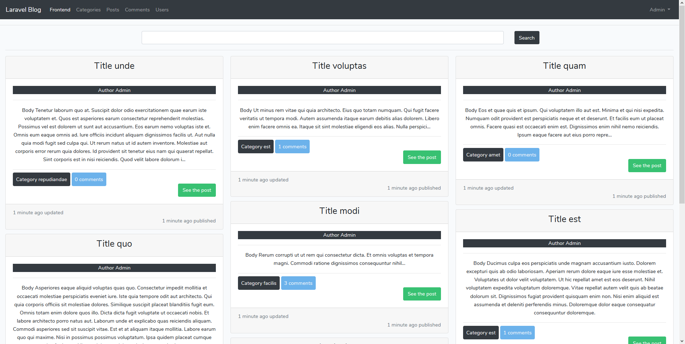
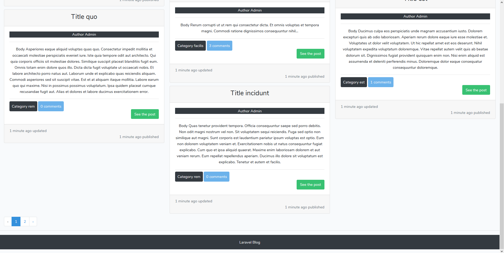
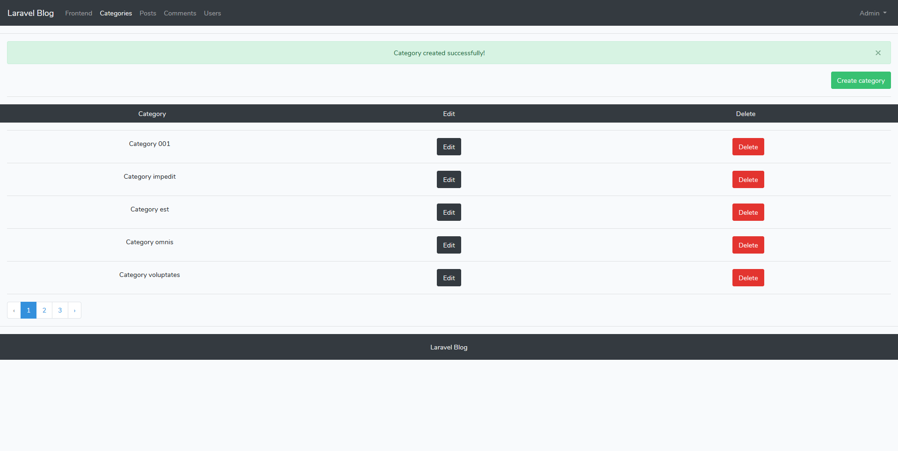
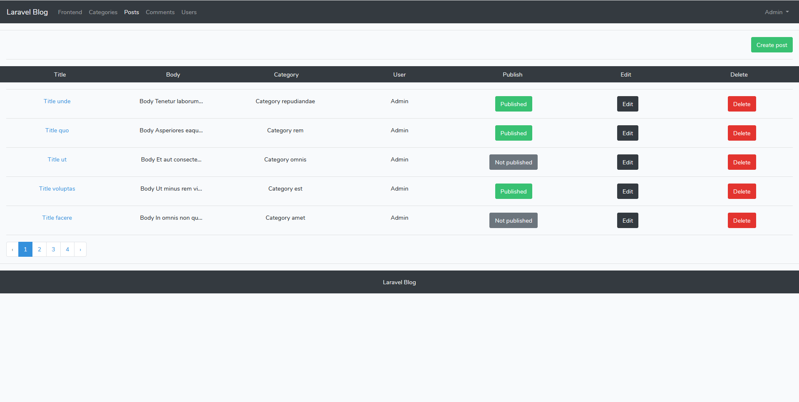
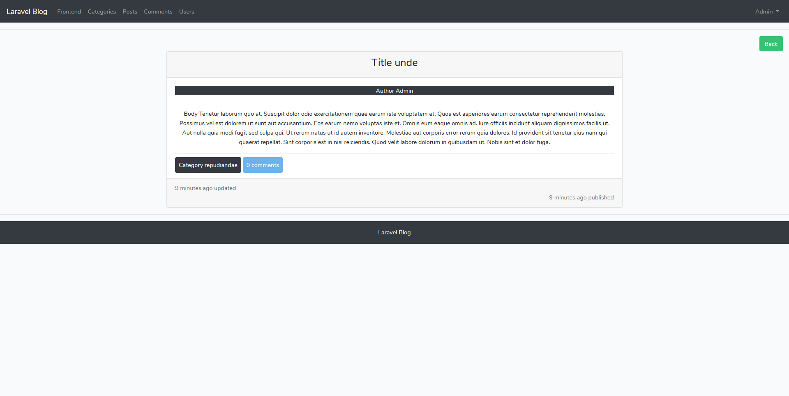
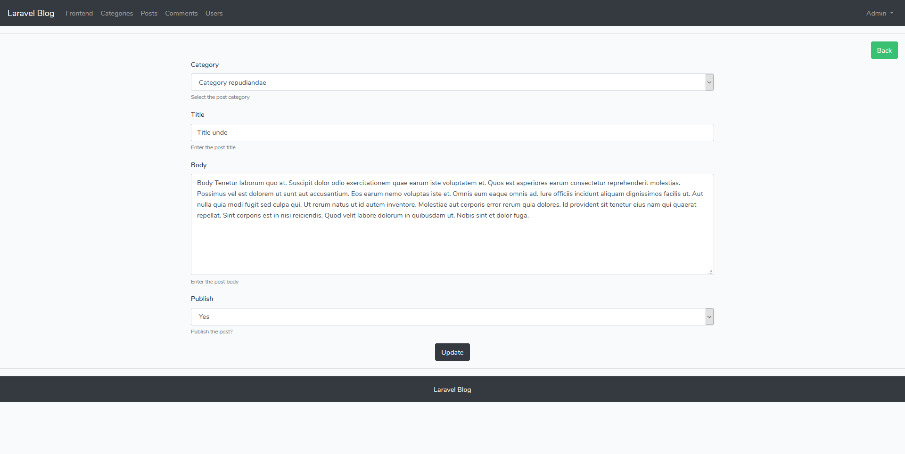
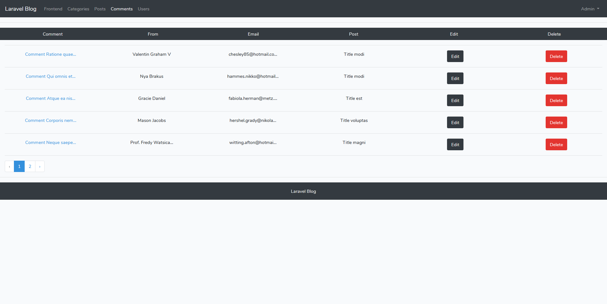
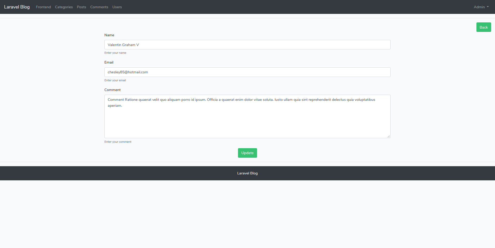
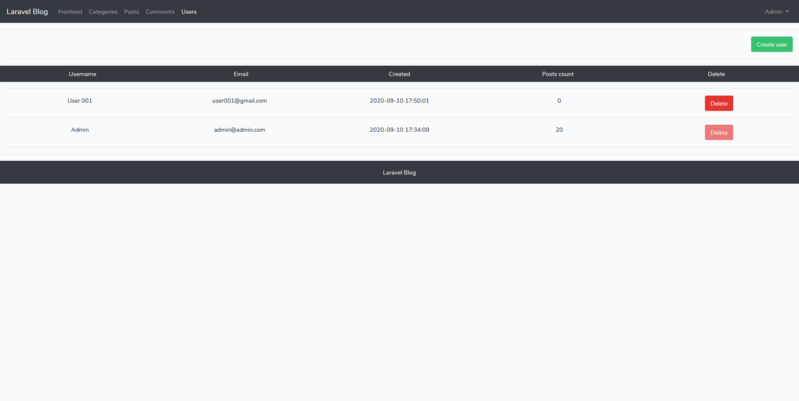
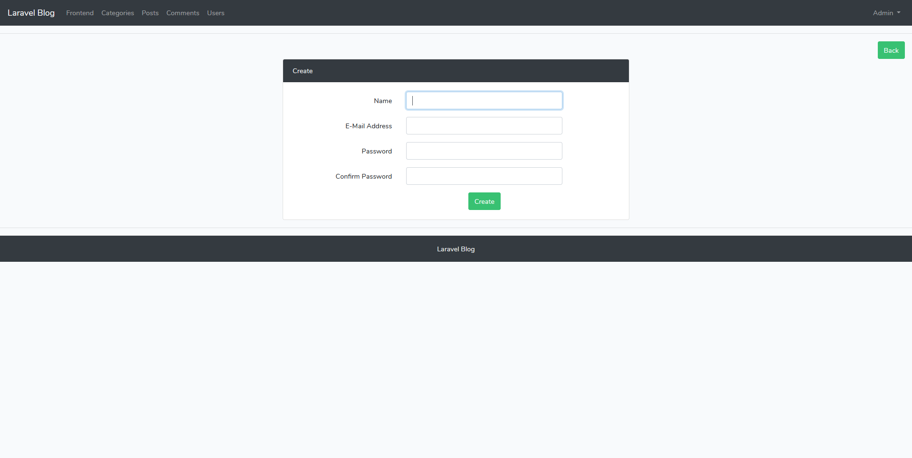

# Laravel Blog

A simple Laravel Blog application.

## Installation

01. Clone the repository
```
git clone https://github.com/danielgogov-github/Laravel_Blog.git
```

02. Install all composer packages
```
composer install
```

03. Copy the .env.example
```
cp .env.example .env
```

04. Set database, database username and database password
```
DB_DATABASE=laravel_blog
DB_USERNAME=username
DB_PASSWORD=password
```

05. Generate application key
```
php artisan key:generate
```

06. Do migration
```
php artisan migrate
```

07. Fill the tables with data
```
php artisan db:seed
```

08. Run the web server
```
php artisan serve
```

09. Frontend
```
http://localhost:8000/
```

10. Backend
```
http://localhost:8000/admin
E-Mail = admin@admin.com
Password = password
```

## Features Frontend

01. Show all posts
02. Show a single post with comments
03. Write a new comment
04. Show all posts from category
05. Search

## Features Backend

### Posts
01. Show all posts
02. Show a single post
03. Create a new post
04. Update a post
05. Delete a post
06. Publish or unpublish a post

### Categories
01. Show all categories
02. Create a new category
03. Update a category
05. Delete a category

### Comments
01. Show all comments
02. Show a single comment
03. Edit a comment
04. Delete a comment

### Users
01. Show all users
02. Create a new user
05. Delete a user

## Screenshots

`Show all posts Frontend`


`Show all posts Frontend`


`Show all categories`


`Show all posts Backend`


`Show a single post`


`Update a post`


`Show all comments`


`Edit a comment`


`Show all users`


`Create a new user`


## Contact

```
danielgogovmail@gmail.com
```
